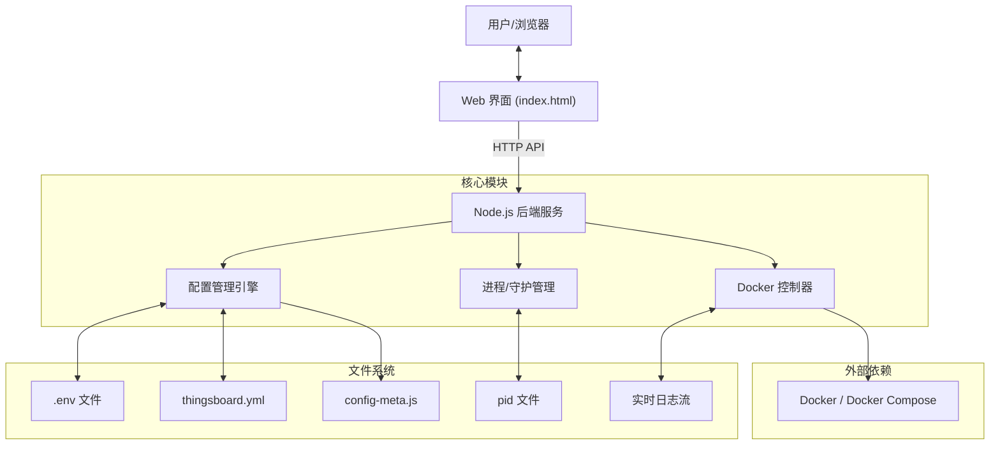

# ThingsBoard Config Mate 项目整体设计文档

## 1. 项目概述 (Project Overview)

**ThingsBoard Config Mate** 是一个专为 ThingsBoard 和 ThingsBoard Edge 设计的轻量级、可视化的本地配置与运维辅助工具。

**核心痛点解决**：

* **配置复杂**：原生的 `thingsboard.yml` 配置文件庞大且参数众多，手动修改容易出错。
* **环境不一致**：开发、测试、生产环境的配置管理混乱（环境变量 vs YAML）。
* **运维繁琐**：本地启动、停止 Docker 容器，查看日志需要频繁切换终端命令。

**设计目标**：

* **开箱即用**：零依赖，单可执行文件发布（使用 `pkg` 打包）。
* **可视化**：提供直观的 Web UI 进行参数配置。
* **双向同步**：支持从 YAML 导入配置，也支持讲配置回写到 YAML。
* **安全可靠**：提供配置备份、服务状态监控和安全加固。

---

## 2. 技术架构 (Technical Architecture)

本项目采用 **B/S 架构**，但打包为本地单体应用发布。

### 2.1 技术栈

* **运行时**：Node.js (LTS)
* **后端框架**：原生 Node.js `http` 模块 + 自研轻量级路由（无 Express/Koa 重依赖，追求极致轻量）。
* **前端**：原生 HTML5 / CSS3 / JavaScript (ES6+)。无 Vue/React 依赖，单文件组件模式。
* **打包工具**：`pkg` (将源码打包为 Win/Mac/Linux 可执行文件)。
* **进程管理**：Node.js `child_process` (spawn, execFile)。
* **容器交互**：直接调用宿主机 `docker` CLI。

### 2.2 架构图



---

## 3. 核心功能模块 (Core Modules)

### 3.1 启动与进程管理 (Boot & Daemon)

为了提供良好的 CLI 体验，程序实现了类似守护进程的机制。

* **前台/后台模式**：
  * `start` 命令：通过 `spawn` 启动子进程（detached 模式），将自身作为服务在后台运行，并记录 PID。
  * `stop/status` 命令：通过读取 PID 文件管理后台进程的生命周期。
* **单实例锁**：利用 PID 文件确保同一目录只能运行一个服务实例。

### 3.2 配置管理引擎 (Configuration Engine)

这是系统的核心大脑，负责处理复杂的配置逻辑。

1. **自动发现 (Auto-Discovery)**：
    * 启动时自动扫描当前及 `conf/` 目录下的 `thingsboard.yml` 或 `tb-edge.yml`。
    * 自动识别应用类型（APP_TYPE）：`CLOUD` 或 `EDGE`。

2. **元数据驱动 (Metadata-Driven)**：
    * **核心定义**：`config-meta.js` 定义了所有支持的配置项，包括：Key、Label、Type、Group（分组）、Validator（校验）和 DependsOn（依赖关系）。
    * **动态 UI**：前端根据元数据动态渲染表单，自动处理分组折叠、依赖显示/隐藏（例如：仅当 `QUEUE_TYPE=Kafka` 时显示 Kafka 配置）。

3. **双向同步策略**：
    * **Import (YAML -> ENV)**：首次启动时，解析 YAML 提取 `${VAR:DEFAULT}` 占位符，生成 `.env` 文件。
    * **Export (ENV -> YAML)**：使用 `--over` 命令，基于正则替换技术，将 `.env` 的值回填到 YAML 的默认值中，同时**保留原文件注释**。

### 3.3 服务控制 (Service Control)

* **Docker 交互**：通过 `child_process.exec` 调用宿主机的 `docker compose` 命令。
* **状态监测**：轮询检查容器状态，实时反馈到 UI（Running/Stopped 状态灯）。
* **操作**：支持 Start（启动/重启）、Stop（停止）。

### 3.4 实时日志 (Log Streaming)

* **技术实现**：Server-Sent Events (SSE)。
* **流程**：
    1. 后端 `spawn('docker', ['compose', 'logs', '-f', ...])`。
    2. 监听 stdout/stderr 数据流。
    3. 通过 HTTP 长连接 (`text/event-stream`) 实时推送到前端。
    4. 前端 `EventSource` 接收并渲染，支持自动滚动和暂停。

---

## 4. 安全与稳定性设计

### 4.1 安全性

1. **Localhost 绑定**：HTTP 服务默认绑定 `127.0.0.1`，防止局域网非授权访问。
2. **文件备份**：任何对 YAML 配置文件的修改操作（如覆盖），系统**强制**创建带时间戳的备份文件（`.bak`）。
3. **输入清洗**：对写入配置文件的值进行转义（如双引号处理），防止破坏文件语法。

### 4.2 稳定性

1. **错误隔离**：关键模块（如 YAML 解析、Docker 调用）均有 Try-Catch 保护，防止主进程崩溃。
2. **优雅退出**：监听 `SIGTERM/SIGINT` 信号，确保退出时清理 PID 文件和子进程。

---

## 5. 项目文件结构

```text
thingsboard-config-mate/
├── package.json          # 项目依赖与脚本
├── tb-config-src.js      # 主程序入口 (Backend & CLI)
├── config-meta.js        # 配置元数据定义
├── index.html            # 单文件前端 UI
├── conf/                 # 默认配置文件目录
│   ├── thingsboard.yml
│   └── tb-edge.yml
├── .env                  # 当前环境配置 (运行时生成)
└── tb-config-mate.log    # 运行日志
```
