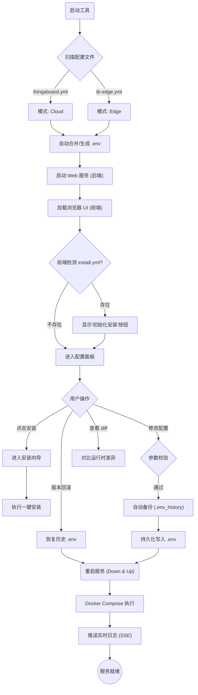

# 可视化配置工具功能设计文档

## 1. 设计初衷与定位

**ThingsBoard Config Mate** 旨在解决 ThingsBoard 及 ThingsBoard Edge 在私有化部署和本地开发中面临的配置繁琐痛点。

传统的配置修改往往需要深入复杂的 `thingsboard.yml` 或 `docker-compose.yml` 文件，容易出错且难以维护。本工具的设计核心是将**复杂的参数配置**简化为**可视化的交互界面**，通过标准化流程干预容器启动参数，实现“一次配置，随处运行”。

## 2. 核心设计理念

### 2.1 以 .env 为核心的配置驱动

系统采用 `.env` 环境变量文件作为配置的“单一事实来源 (Single Source of Truth)”。

- **解耦**: 将易变的配置参数（如数据库地址、密钥、功能开关）与静态的程序代码/镜像分离。
- **便携**: 运维人员只需管理轻量级的 `.env` 文件，即可控制整个系统的运行行为。

### 2.2 容器化注入机制

本工具不直接修改编译后的 JAR 包或二进制文件，而是利用 Docker 容器的特性，在**运行时 (Runtime)** 注入配置：

1. **收集**: 用户在可视化界面修改配置。
2. **生成**: 工具自动生成标准化的 `.env` 文件。
3. **注入**: 服务启动时，Docker 容器自动加载该文件，覆盖默认的 YAML 配置。

---

## 3. 功能架构

### 3.1 可视化配置管理

- **动态表单**: 自动屏蔽不仅要的底层细节，根据用户选择（如 Cloud/Edge 模式）动态展示相关配置项。
- **智能校验**: 对数据库连接、队列类型等关键参数进行实时逻辑校验，防止无效配置导致服务启动失败。
- **透明转换**:
  - 界面操作：`开启 Swagger 文档` -> `点击开关`
  - 底层转换：`SWAGGER_ENABLED=true` (写入 .env)
- **源码模式 (Source Mode)**: 针对高级用户，提供 `.env` 文件的直接编辑能力，支持语法高亮，满足批量复制粘贴或微调的需求。

### 3.2 容器生命周期干预

工具深度集成了 Docker 控制能力，形成闭环的运维流程：

- **一键启动/重启**: 修改配置后，可直接触发服务重启，新配置即刻生效。
- **启动参数控制**:
  - 自动识别当前环境（Cloud 或 Edge）。
  - 自动挂载配置文件和数据卷。
  - 动态设置 JVM 参数和内存限制。

> **⚠️ 注意**: 为了使工具生成的配置生效，您的 `docker-compose.yml` 服务定义中**必须**显式包含 `env_file: .env` 配置项。否则，即便工具修改了环境变量，容器启动时也无法正常加载。

### 3.3 运维辅助

- **实时日志流**: 无需 SSH 登录服务器，直接在界面查看容器的标准输出日志，快速定位启动错误。

### 3.4 配置版本控制与回退 (Configuration Version Control)

为了应对误操作导致的配置失效，系统内置了轻量级的版本控制机制，确保配置变更的“可追溯”和“可回滚”。

- **自动备份**: 每次用户点击“保存配置”时，系统会在写入新 `.env` 之前，自动将当前的 `.env` 文件备份到 `.env_history/` 目录。
- **差异对比 (Diff)**: 在回滚前，用户可以直观地对比“历史版本”与“当前版本”的差异，明确知晓哪些参数发生了变化（新增、删除或修改）。
- **版本轮转 (Rotation)**: 采用 FIFO (先进先出) 策略管理备份文件，系统默认保留最近 5 个历史版本，自动清理陈旧备份，防止占用过多磁盘空间。
- **一键回滚**:
  1. 用户在“历史版本”列表中选择目标时间点。
  2. 系统将选中的备份文件内容覆盖回 `.env`。
  3. 触发服务重启，使回滚的配置生效。

### 3.5 运行时视差监测 (Runtime Drift Detection)

除了配置文件的历史版本与当前版本的对比，本工具还引入了**运行时环境**与**本地配置**的实时比对功能，以解决“配置文件已修改但容器未重启”导致的配置漂移问题。

- **实时探测**: 通过 Docker API (`docker inspect`) 获取当前正在运行容器的实际环境变量。
- **三态对比**:
  - **Match (一致)**: 本地配置与运行时一致。
  - **Modified (差异)**: 本地配置已修改，但容器使用的是旧值（提示需要重启）。
  - **Missing (缺失)**: 容器中存在但本地 `.env` 中不存在，或反之。

### 3.6 安装与初始化向导 (Installation Wizard)

为了简化首次部署流程，工具内置了安装向导功能：

- **环境检查**: 启动时自动检测 `docker-compose-install.yml` 是否存在。
- **一键安装**: 如果检测到安装脚本，提供可视化界面引导用户执行一键安装（执行 `docker compose -f docker-compose-install.yml up`）。
- **流程可视化**: 实时展示安装过程的日志输出，确保用户了解安装进度和结果。

### 3.7 静态文件回写 (Static Injection)

针对不支持 `env_file` 或需要固化配置的场景，工具提供了 `--over` 命令行模式。

- **功能**: 将 `.env` 中的环境变量值直接写入 `thingsboard.yml` 或 `tb-edge.yml` 配置文件。
- **机制**: 智能识别 `${VAR_NAME}` 占位符并进行替换，生成无变量引用的纯静态配置文件。

---

## 4. 标准工作流 (Workflow)

1. **初始化与检测 (Init & Detect)**:
   - 工具启动，自动检测 `conf/` 目录下是否存在 `tb-edge.yml` 或 `thingsboard.yml` 以确定运行模式 (Cloud/Edge)。
   - 扫描 `.env` 文件，如果缺少关键配置，自动从 YAML 配置文件提取默认值并追加到 `.env` 中 (Auto-Mapping)。

2. **配置修改 (Config)**:
   - 启动 Web 服务 (默认端口 3300)，用户通过浏览器访问配置界面。
   - 界面根据当前模式 (Cloud/Edge) 动态展示相关配置项，隐藏无关选项。
   - 用户调整参数（例如：启用 Swagger、修改数据库类型），系统并在前端实时校验数据格式。

3. **持久化 (Persist)**:
   - 用户点击“保存配置”。
   - 工具将校验后的参数写入 `.env` 文件，覆盖旧值，确保配置持久化。

4. **应用生效 (Apply)**:
   - 用户点击“重启服务”或手动执行 `docker compose up -d`。
   - Docker 容器读取更新后的 `.env` 文件 (`env_file` 机制)，加载新参数。
   - 服务以全新配置启动，变更正式生效。

### 4.1 流程图解

---

## 5. 配置项参考 (Edge 模式)

以下是 ThingsBoard Edge 部署模式下的标准配置项清单，所有配置项均可在界面中编辑并写入 `.env` 文件：

### 5.1 Edge 连接配置

| 配置项 | 说明 | 类型 |
|--------|------|------|
| `CLOUD_ROUTING_KEY` | Edge 路由标识 (UUID) | 必填 |
| `CLOUD_ROUTING_SECRET` | Edge 上云验证密钥 | 必填 |
| `CLOUD_RPC_HOST` | 云端 RPC 主机地址 | 可选 |

### 5.2 Edge 状态检查

| 配置项 | 说明 | 类型 |
|--------|------|------|
| `CLOUD_CHECK_STATUS_BASE_URL` | 状态检查 Base URL | 可选 |
| `CLOUD_CHECK_STATUS_TENANT_USERNAME` | 状态检查租户账号 | 可选 |
| `CLOUD_CHECK_STATUS_TENANT_PASSWORD` | 状态检查租户密码 | 可选 |
| `CLOUD_CHECK_STATUS_PERIOD_MIN` | 状态检查周期 (分钟) | 可选 |

### 5.3 Edge 存储与队列

| 配置项 | 说明 | 条件依赖 |
|--------|------|----------|
| `EDGES_STORAGE_HISTORY_STATUS` | 启用实时优先 | - |
| `EDGES_STORAGE_MAX_READ_HISTORY_COUNT` | 历史数据每次上送条数 | - |
| `EDGES_STORAGE_REALTIME_LAG_THRESHOLD_MS` | 实时数据延迟阈值 (ms) | 仅 in-memory 队列 |
| `EDGES_STORAGE_KAFKA_BACKFILL_THRESHOLD_MS` | Kafka 回填历史间隔 (ms) | 仅 Kafka 队列 |

### 5.4 遥测分离配置

| 配置项 | 说明 | 条件依赖 |
|--------|------|----------|
| `TELEMETRY_SEPARATION_ENABLED` | 启用遥测读写分离 | - |
| `TELEMETRY_GRPC_CLIENT_HOST` | 遥测 gRPC 主机地址 | 遥测分离开启时 |
| `TB_QUEUE_KAFKA_TELEMETRY_TS_KV_CLOUD_EVENT_MAX_POLL_RECORDS` | 遥测分离拉取条数 | 遥测分离 + Kafka |
| `TB_QUEUE_TELEMETRY_TS_KV_CLOUD_EVENT_PARTITIONS` | 遥测分离队列分区数 | 遥测分离 + Kafka |

### 5.5 核心存储

| 配置项 | 说明 | 类型 |
|--------|------|------|
| `DATABASE_TS_TYPE` | 历史数据存储类型 (sql/cassandra) | 必填 |
| `DATABASE_TS_LATEST_TYPE` | 最新数据存储类型 (sql/cassandra/redis) | 必填 |
| `TS_KV_TTL` | 系统数据过期时间 (秒) | 仅 Cassandra |
| `SQL_TTL_TS_EXECUTION_INTERVAL` | 时序数据清理间隔 (ms) | 可选 |
| `SQL_TTL_TS_TS_KEY_VALUE_TTL` | 时序数据保留时间 (秒) | 可选 |
| `SQL_TTL_CLOUD_EVENTS_EXECUTION_INTERVAL` | 云事件清理间隔 (ms) | 可选 |
| `SQL_TTL_CLOUD_EVENTS_TTL` | 云事件保留时间 (秒) | 可选 |

### 5.6 PostgreSQL 配置

| 配置项 | 说明 | 类型 |
|--------|------|------|
| `SPRING_DATASOURCE_URL` | PostgreSQL 连接 URL | 必填 |
| `SPRING_DATASOURCE_USERNAME` | PostgreSQL 用户名 | 必填 |
| `SPRING_DATASOURCE_PASSWORD` | PostgreSQL 密码 | 必填 |

### 5.7 Cassandra 配置

| 配置项 | 说明 | 条件依赖 |
|--------|------|----------|
| `CASSANDRA_URL` | Cassandra 节点地址 | 选择 Cassandra 时显示 |
| `CASSANDRA_KEYSPACE_NAME` | Keyspace 名称 | 选择 Cassandra 时显示 |
| `CASSANDRA_CLUSTER_NAME` | 集群名称 | 选择 Cassandra 时显示 |
| `CASSANDRA_USERNAME` | Cassandra 用户名 | 选择 Cassandra 时显示 |
| `CASSANDRA_PASSWORD` | Cassandra 密码 | 选择 Cassandra 时显示 |

### 5.8 缓存配置 (Redis)

| 配置项 | 说明 | 条件依赖 |
|--------|------|----------|
| `CACHE_TYPE` | 缓存类型 (caffeine/redis) | 必填 |
| `REDIS_CONNECTION_TYPE` | Redis 连接模式 (standalone/cluster) | 选择 Redis 时显示 |
| `REDIS_HOST` | Redis 主机地址 | standalone 模式 |
| `REDIS_PORT` | Redis 端口 | standalone 模式 |
| `REDIS_NODES` | Redis 集群节点列表 | cluster 模式 |
| `REDIS_DB` | Redis 库索引 | standalone 模式 |
| `REDIS_PASSWORD` | Redis 密码 | 可选 |

### 5.9 规则引擎脚本

| 配置项 | 说明 | 默认值 |
|--------|------|--------|
| `TBEL_MAX_TOTAL_ARGS_SIZE` | TBEL 最大参数大小 | 100000 |
| `TBEL_MAX_RESULT_SIZE` | TBEL 最大结果大小 | 300000 |
| `TBEL_MAX_SCRIPT_BODY_SIZE` | TBEL 最大脚本体大小 | 50000 |
| `JS_MAX_TOTAL_ARGS_SIZE` | JS 最大参数大小 | 100000 |
| `JS_MAX_RESULT_SIZE` | JS 最大结果大小 | 300000 |
| `JS_MAX_SCRIPT_BODY_SIZE` | JS 最大脚本体大小 | 50000 |

### 5.10 消息队列

| 配置项 | 说明 | 条件依赖 |
|--------|------|----------|
| `TB_QUEUE_TYPE` | 队列类型 (kafka/in-memory) | 必填 |
| `TB_KAFKA_SERVERS` | Kafka 服务器地址 | 仅 Kafka 队列 |
| `TB_QUEUE_KAFKA_CLOUD_EVENT_MAX_POLL_RECORDS` | Cloud Event 队列拉取条数 | 仅 Kafka 队列 |

### 5.11 MQTT 传输

| 配置项 | 说明 | 默认值 |
|--------|------|--------|
| `NETTY_MAX_PAYLOAD_SIZE` | MQTT 最大载荷 (Bytes) | 65536 |
| `MQTT_BIND_PORT`         | MQTT 监听端口         | 1883 |

### 5.12 高级设置

| 配置项 | 说明 | 默认值 |
|--------|------|--------|
| `SWAGGER_ENABLED` | 启用 Swagger 文档 | false |

---

## 6. 配置项参考 (Cloud 模式)

以下是 ThingsBoard Cloud 部署模式下的标准配置项清单。Cloud 模式相比 Edge 模式，主要区别在于**没有 Edge 连接/状态检查/遥测分离相关配置**，但**增加了 MQTT 监听端口配置**。

### 6.1 核心存储

| 配置项 | 说明 | 类型 |
|--------|------|------|
| `DATABASE_TS_TYPE` | 历史数据存储类型 (sql/cassandra) | 必填 |
| `DATABASE_TS_LATEST_TYPE` | 最新数据存储类型 (sql/cassandra/redis) | 必填 |
| `TS_KV_TTL` | 系统数据过期时间 (秒) | 仅 Cassandra |

### 6.2 PostgreSQL 配置

| 配置项 | 说明 | 类型 |
|--------|------|------|
| `SPRING_DATASOURCE_URL` | PostgreSQL 连接 URL | 必填 |
| `SPRING_DATASOURCE_USERNAME` | PostgreSQL 用户名 | 必填 |
| `SPRING_DATASOURCE_PASSWORD` | PostgreSQL 密码 | 必填 |

### 6.3 Cassandra 配置

| 配置项 | 说明 | 条件依赖 |
|--------|------|----------|
| `CASSANDRA_URL` | Cassandra 节点地址 | 选择 Cassandra 时显示 |
| `CASSANDRA_KEYSPACE_NAME` | Keyspace 名称 | 选择 Cassandra 时显示 |
| `CASSANDRA_CLUSTER_NAME` | 集群名称 | 选择 Cassandra 时显示 |
| `CASSANDRA_USERNAME` | Cassandra 用户名 | 选择 Cassandra 时显示 |
| `CASSANDRA_PASSWORD` | Cassandra 密码 | 选择 Cassandra 时显示 |

### 6.4 缓存配置 (Redis)

| 配置项 | 说明 | 条件依赖 |
|--------|------|----------|
| `CACHE_TYPE` | 缓存类型 (caffeine/redis) | 必填 |
| `REDIS_CONNECTION_TYPE` | Redis 连接模式 (standalone/cluster) | 选择 Redis 时显示 |
| `REDIS_HOST` | Redis 主机地址 | standalone 模式 |
| `REDIS_PORT` | Redis 端口 | standalone 模式 |
| `REDIS_NODES` | Redis 集群节点列表 | cluster 模式 |
| `REDIS_DB` | Redis 库索引 | standalone 模式 |
| `REDIS_PASSWORD` | Redis 密码 | 可选 |

### 6.5 规则引擎脚本

| 配置项 | 说明 | 默认值 |
|--------|------|--------|
| `TBEL_MAX_TOTAL_ARGS_SIZE` | TBEL 最大参数大小 | 100000 |
| `TBEL_MAX_RESULT_SIZE` | TBEL 最大结果大小 | 300000 |
| `TBEL_MAX_SCRIPT_BODY_SIZE` | TBEL 最大脚本体大小 | 50000 |
| `JS_MAX_TOTAL_ARGS_SIZE` | JS 最大参数大小 | 100000 |
| `JS_MAX_RESULT_SIZE` | JS 最大结果大小 | 300000 |
| `JS_MAX_SCRIPT_BODY_SIZE` | JS 最大脚本体大小 | 50000 |

### 6.6 消息队列

| 配置项 | 说明 | 条件依赖 |
|--------|------|----------|
| `TB_QUEUE_TYPE` | 队列类型 (kafka/in-memory) | 必填 |
| `TB_KAFKA_SERVERS` | Kafka 服务器地址 | 仅 Kafka 队列 |

### 6.7 MQTT 传输

| 配置项 | 说明 | 默认值 |
|--------|------|--------|
| `MQTT_BIND_PORT` | MQTT 监听端口 | 1883 |
| `NETTY_MAX_PAYLOAD_SIZE` | MQTT 最大载荷 (Bytes) | 65536 |

### 6.8 高级设置

| 配置项 | 说明 | 默认值 |
|--------|------|--------|
| `SWAGGER_ENABLED` | 启用 Swagger 文档 | false |

---

## 7. Cloud 与 Edge 配置差异对比

| 功能模块 | Cloud | Edge |
|----------|-------|------|
| Edge 连接配置 | ❌ | ✅ |
| Edge 状态检查 | ❌ | ✅ |
| 遥测分离配置 | ❌ | ✅ |
| Edge 存储与队列调优 | ❌ | ✅ |
| SQL TTL 清理配置 | ❌ | ✅ |
| MQTT 监听端口 | ✅ | ❌ |
| 核心存储/数据库 | ✅ | ✅ |
| 缓存配置 | ✅ | ✅ |
| 消息队列 | ✅ | ✅ |
| 规则引擎脚本 | ✅ | ✅ |

---

## 8. 总结

**ThingsBoard Config Mate** 不是一个简单的文本编辑器，而是一个**配置注入器**。它屏蔽了 Docker 和 Spring Boot 配置文件的复杂性，让运维人员和开发者能够通过直观的 GUI，安全、高效地掌控 ThingsBoard 服务的启动行为。
