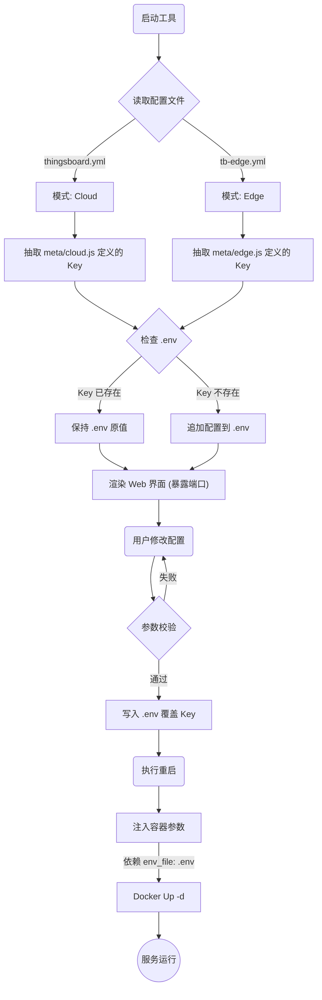

# ThingsBoard Config Mate 功能设计文档

## 1. 设计初衷与定位

**ThingsBoard Config Mate** 旨在解决 ThingsBoard 及 ThingsBoard Edge 在私有化部署和本地开发中面临的配置繁琐痛点。

传统的配置修改往往需要深入复杂的 `thingsboard.yml` 或 `docker-compose.yml` 文件，容易出错且难以维护。本工具的设计核心是将**复杂的参数配置**简化为**可视化的交互界面**，通过标准化流程干预容器启动参数，实现“一次配置，随处运行”。

## 2. 核心设计理念

### 2.1 以 .env 为核心的配置驱动

系统采用 `.env` 环境变量文件作为配置的“单一事实来源 (Single Source of Truth)”。

- **解耦**: 将易变的配置参数（如数据库地址、密钥、功能开关）与静态的程序代码/镜像分离。
- **便携**: 运维人员只需管理轻量级的 `.env` 文件，即可控制整个系统的运行行为。

### 2.2 容器化注入机制

本工具不直接修改编译后的 JAR 包或二进制文件，而是利用 Docker 容器的特性，在**运行时 (Runtime)** 注入配置：

1. **收集**: 用户在可视化界面修改配置。
2. **生成**: 工具自动生成标准化的 `.env` 文件。
3. **注入**: 服务启动时，Docker 容器自动加载该文件，覆盖默认的 YAML 配置。

---

## 3. 功能架构

### 3.1 可视化配置管理

- **动态表单**: 自动屏蔽不仅要的底层细节，根据用户选择（如 Cloud/Edge 模式）动态展示相关配置项。
- **智能校验**: 对数据库连接、队列类型等关键参数进行实时逻辑校验，防止无效配置导致服务启动失败。
- **透明转换**:
  - 界面操作：`开启 Swagger 文档` -> `点击开关`
  - 底层转换：`SWAGGER_ENABLED=true` (写入 .env)

### 3.2 容器生命周期干预

工具深度集成了 Docker 控制能力，形成闭环的运维流程：

- **一键启动/重启**: 修改配置后，可直接触发服务重启，新配置即刻生效。
- **启动参数控制**:
  - 自动识别当前环境（Cloud 或 Edge）。
  - 自动挂载配置文件和数据卷。
  - 动态设置 JVM 参数和内存限制。

> **⚠️ 注意**: 为了使工具生成的配置生效，您的 `docker-compose.yml` 服务定义中**必须**显式包含 `env_file: .env` 配置项。否则，即便工具修改了环境变量，容器启动时也无法正常加载。

### 3.3 运维辅助

- **实时日志流**: 无需 SSH 登录服务器，直接在界面查看容器的标准输出日志，快速定位启动错误。

### 3.4 配置版本控制与回退 (Configuration Version Control)

为了应对误操作导致的配置失效，系统内置了轻量级的版本控制机制，确保配置变更的“可追溯”和“可回滚”。

- **自动备份**: 每次用户点击“保存配置”时，系统会在写入新 `.env` 之前，自动将当前的 `.env` 文件备份到 `.env_history/` 目录。
- **差异对比 (Diff)**: 在回滚前，用户可以直观地对比“历史版本”与“当前版本”的差异，明确知晓哪些参数发生了变化（新增、删除或修改）。
- **版本轮转 (Rotation)**: 采用 FIFO (先进先出) 策略管理备份文件，系统默认保留最近 5 个历史版本，自动清理陈旧备份，防止占用过多磁盘空间。
- **一键回滚**:
  1. 用户在“历史版本”列表中选择目标时间点。
  2. 系统将选中的备份文件内容覆盖回 `.env`。
  3. 触发服务重启，使回滚的配置生效。

---

## 4. 标准工作流 (Workflow)

1. **初始化与检测 (Init & Detect)**:
   - 工具启动，自动检测 `conf/` 目录下是否存在 `tb-edge.yml` 或 `thingsboard.yml` 以确定运行模式 (Cloud/Edge)。
   - 扫描 `.env` 文件，如果缺少关键配置，自动从 YAML 配置文件提取默认值并追加到 `.env` 中 (Auto-Mapping)。

2. **配置修改 (Config)**:
   - 启动 Web 服务 (默认端口 3300)，用户通过浏览器访问配置界面。
   - 界面根据当前模式 (Cloud/Edge) 动态展示相关配置项，隐藏无关选项。
   - 用户调整参数（例如：启用 Swagger、修改数据库类型），系统并在前端实时校验数据格式。

3. **持久化 (Persist)**:
   - 用户点击“保存配置”。
   - 工具将校验后的参数写入 `.env` 文件，覆盖旧值，确保配置持久化。

4. **应用生效 (Apply)**:
   - 用户点击“重启服务”或手动执行 `docker compose up -d`。
   - Docker 容器读取更新后的 `.env` 文件 (`env_file` 机制)，加载新参数。
   - 服务以全新配置启动，变更正式生效。

### 4.1 流程图解

---

## 5. 总结

**ThingsBoard Config Mate** 不是一个简单的文本编辑器，而是一个**配置注入器**。它屏蔽了 Docker 和 Spring Boot 配置文件的复杂性，让运维人员和开发者能够通过直观的 GUI，安全、高效地掌控 ThingsBoard 服务的启动行为。
